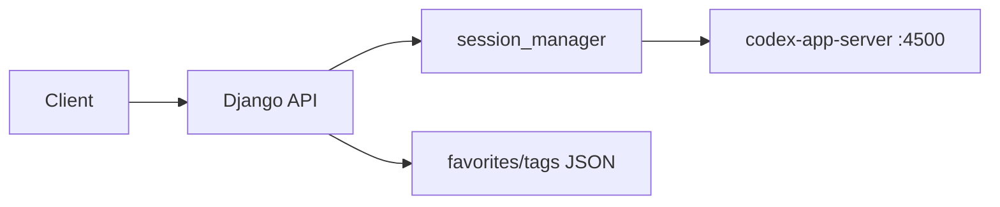
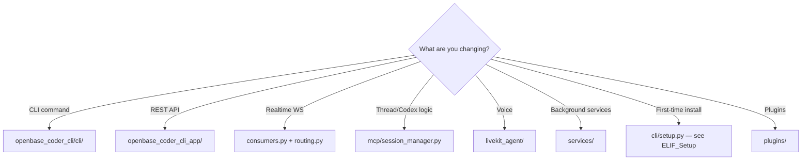

# Learning Path

**Audience:** You (primary), contributors, AI agents  
**Goal:** Build a solid foundation, then layer complexity progressively  
**Index:** [INDEX.md](./INDEX.md)

---

## Recommended Entry Point

**Do not start with `setup.py`.** It is ~1200 lines and orchestrates the entire install pipeline — valuable, but only after you understand what the runtime *is* and how a single API request flows.

**Start here:**

1. [01_Repo_vs_Workspace](./01_Repo_vs_Workspace.md) — 15 min
2. Skim [2026-06-18 ELIF_Codebase](./2026-06-18%20ELIF_Codebase.md) — 20 min
3. [02_Dev_Cheatsheet](./02_Dev_Cheatsheet.md) — run the commands
4. [03_Request_Trace_Threads](./03_Request_Trace_Threads.md) — 30 min hands-on

---

## Level 1 — Orientation (Day 1)

**Outcome:** You can explain what this repo does and run it locally for API development.

| Step | Document / Action | Exercise |
|------|-------------------|----------|
| 1.0 | Run `./scripts/dev-sync.sh` from repo root | `uv run openbase-coder --version` prints a version |
| 1.1 | Read [01_Repo_vs_Workspace](./01_Repo_vs_Workspace.md) | Draw the three-repo layout from memory |
| 1.2 | Skim [ELIF_Codebase](./2026-06-18%20ELIF_Codebase.md) | List the 4 background services and their ports |
| 1.3 | [02_Dev_Cheatsheet](./02_Dev_Cheatsheet.md) — **UV primer** + repo-only dev | `uv sync --extra dev && uv run pytest -q` (see [command breakdown](./02_Dev_Cheatsheet.md#uv--python-primer)) |
| 1.4 | Run API server | `uv run openbase-coder server --reload --skip-collectstatic` |
| 1.5 | Hit health endpoint | `curl -s http://127.0.0.1:7999/api/health/ \| jq` |

**Checkpoint:** You know this repo is the CLI + Django API + voice worker package, separate from the workspace clone at `~/.openbase/workspace`.

---

## Level 2 — Control Plane (Day 2–3)

**Outcome:** You can follow an HTTP request from URL to Codex app-server and back.

| Step | Document / Action | Exercise |
|------|-------------------|----------|
| 2.1 | Read [03_Request_Trace_Threads](./03_Request_Trace_Threads.md) | Follow the file chain in your editor |
| 2.2 | Add a temporary log line in `thread_list` | Confirm it appears when you `curl /api/threads/` |
| 2.3 | Read `mcp/models.py` | Identify `ThreadInfo` vs Django models (there are none) |
| 2.4 | Run thread tests | `uv run pytest tests/test_threads_api.py -v` |

**Checkpoint:** You understand that thread state lives in Codex app-server, not SQLite.

---

## Level 3 — Install & Services (Day 4–5)

**Outcome:** You understand how `setup` wires the machine and what runs in the background.

| Step | Document / Action | Exercise |
|------|-------------------|----------|
| 3.1 | Read [ELIF_Setup](./2026-06-18%20ELIF_Setup.md) | Map each setup phase to output files in `~/.openbase` |
| 3.2 | Read `services/definitions.py` | Match service names to ports |
| 3.3 | Run setup (if not done) or inspect existing install | `openbase-coder doctor` |
| 3.4 | Check services | `openbase-coder services status` |
| 3.5 | Tail one log | `openbase-coder services logs django-cli` |

**Checkpoint:** You can explain `installation.json`, `.env`, and why the workspace is cloned.

---

## Level 4 — Voice & Agents (Week 2+)

**Outcome:** You understand the voice stack well enough to debug or extend it.

| Step | Document / Action | Exercise |
|------|-------------------|----------|
| 4.1 | Re-read ELIF_Codebase **Voice Agent** section | List STT/TTS providers |
| 4.2 | Read top of `livekit_agent/livekit.py` (first ~150 lines) | Note env vars and defaults |
| 4.3 | Read `livekit_agent/codex_app_client.py` class docstring | Trace websocket to Codex |
| 4.4 | Skim `dispatcher_config.py` | Understand dispatcher vs super-agent routing |
| 4.5 | Run voice tests | `uv run pytest tests/test_livekit_agent_codex_app_client.py -v` |

**Checkpoint:** You know voice goes LiveKit → livekit-agent → codex-app-server, not Django directly.

*Future doc: `ELIF_LiveKit.md`*

---

## Level 5 — Extension Points (as needed)

| Topic | When | Future doc |
|-------|------|--------------|
| Plugins | Adding console pages or bootstrappers | `ELIF_Plugins.md` |
| MCP tools | Thread import/export, dispatcher settings | `ELIF_Session_Manager.md` |
| Auth | JWT / Openbase Cloud login | section in ELIF or dedicated doc |
| Codex sync | Cross-device threads | `cli/codex_sync.py` + tests |
| Routines | Scheduled agent runs | `openbase_coder_cli_app/routines.py` |

---

## Weekly Keep-Up Habits

| Habit | Why |
|-------|-----|
| Glance [CHANGELOG](./CHANGELOG.md) when pulling main | See if companion docs were updated |
| Run `uv run pytest -q` before/after changes | Fast regression signal |
| Add a dated ELIF when you learn something non-obvious | Future-you (and agents) benefit |
| Update INDEX **Planned** → **Evergreen** when a doc ships | Keeps the library navigable |

---

## Decision Guide: Where Do I Look?

---

## Next Document to Write

After completing Level 2, the highest-value follow-up is **`04_Request_Trace_WebSocket.md`** (trace `/ws/threads/<id>/`).
