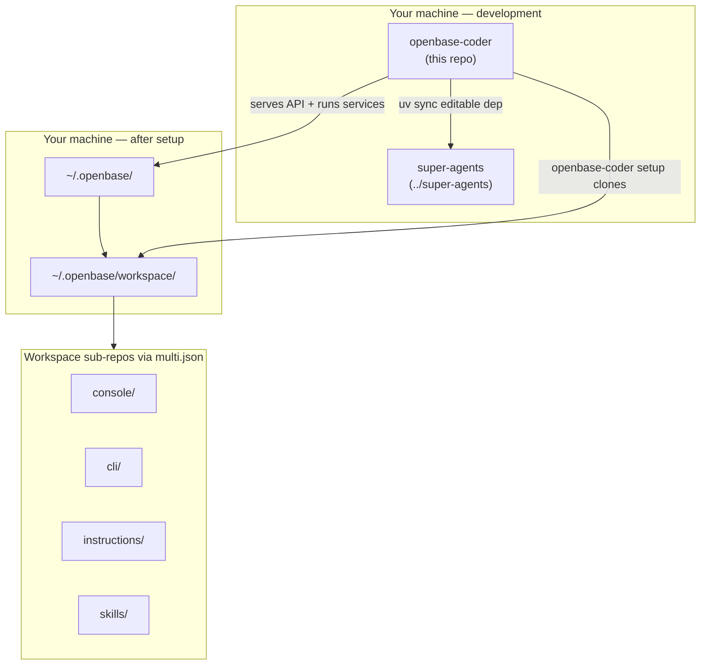

# Repo vs Workspace

**Why this matters:** Openbase Coder is split across multiple repositories. Confusing them is the most common ramp-up mistake.  
**Read before:** Diving into `setup.py` or wondering why the console is not in this repo.  
**Index:** [INDEX.md](./INDEX.md)

---

## The Three Repos in Your Dev Layout

| Repo | Typical path | What it is |
|------|--------------|------------|
| **openbase-coder** (this repo) | `.../openbase-coder/` | PyPI package: CLI, Django API, LiveKit worker, service installers |
| **openbase-coder-workspace** | `~/.openbase/workspace/` (after setup) or cloned separately | Meta-repo: console UI, instructions, skills, `multi.json` sub-repos |
| **super-agents** | `../super-agents/` (editable dep) | Codex app-server client library used by session manager and voice agent |



---

## This Repo (`openbase-coder`)

**Published as:** `openbase-coder` on PyPI  
**Entry point:** `openbase-coder` → `openbase_coder_cli.cli:main`

**Owns:**

- All CLI commands (`openbase_coder_cli/cli/`)
- Django API + WebSockets (`openbase_coder_cli/openbase_coder_cli_app/`)
- LiveKit voice worker (`openbase_coder_cli/livekit_agent/`)
- Service definitions and launchd/systemd install (`openbase_coder_cli/services/`)
- Plugin runtime (`openbase_coder_cli/plugins/`)
- MCP server tools (`openbase_coder_cli/mcp/`)

**Does not own:**

- React web console source (built from workspace `console/`)
- Default voice/dispatcher instruction markdown (seeded from workspace `instructions/`)
- Workspace skill sources (symlinked from workspace `skills/`)

**Local dev without full setup:**

```bash
cd openbase-coder
uv sync --extra dev          # pulls ../super-agents editable
uv run pytest
uv run openbase-coder server --reload
```

You can develop API/CLI code without cloning the workspace — but the console SPA and some setup-time assets will be missing until setup runs.

---

## The Workspace (`openbase-coder-workspace`)

**Remote:** `https://github.com/openbase-community/openbase-coder-workspace.git`  
**Default local path:** `~/.openbase/workspace/`  
**Declared in:** `installation.json` → `workspace_path`

The workspace is a **meta-repository** managed by [multi-workspace](https://pypi.org/project/multi-workspace/). Its `multi.json` lists sub-repos and which belong to the `default` install set.

**Setup does:**

1. `git clone` the workspace (or pull if it exists)
2. `multi sync --install-set default` — clones/updates sub-repos
3. Builds `console/` with npm
4. Seeds `~/.openbase/instructions/` from workspace `instructions/`
5. Symlinks skills from workspace into Codex/Claude homes
6. Runs `uv sync` in workspace `cli/` for the LiveKit worker venv

```text
~/.openbase/workspace/
├── multi.json          # sub-repo manifest + install sets
├── console/            # React SPA → built to console/dist
├── cli/                # workspace CLI venv (LiveKit worker context)
├── instructions/       # VOICE_, DISPATCHER_, SUPER_AGENT_ templates
├── skills/             # skill sources symlinked into agent homes
└── <other sub-repos>/  # per multi.json "default" install set
```

**Coupling to this repo:**

| This repo reads… | From workspace… |
|----------------|-----------------|
| Console static files | `{workspace}/console/dist` (via `CONSOLE_BUILD_DIR`) |
| Instruction seeds | `{workspace}/instructions/*.md` |
| Skill symlinks | `{workspace}/skills/skills/<name>/` |
| LiveKit worker cwd | `{workspace}/cli` (service definition) |

Reference: `openbase_coder_cli/cli/setup.py` — `WORKSPACE_REPO`, `WORKSPACE_INSTALL_SET = "default"`, `_multi_sync()`, `_build_console()`.

---

## `super-agents` (sibling repo)

**Must be cloned before `uv sync`.** Not optional for local development.

**Clone:**

```bash
cd "$(dirname "$(pwd)")"   # parent of openbase-coder
git clone https://github.com/montaguegabe/super-agents.git
```

**Path in pyproject.toml:**

```toml
[tool.uv.sources]
super-agents = { path = "../super-agents", editable = true }
```

**Used by:**

- `mcp/session_manager.py` — `CodexAppServerClient` for thread list/detail/turns
- `livekit_agent/` — Super Agents dispatch client
- Setup — registers Super Agents MCP in Codex/Claude config

If `../super-agents` is missing, `uv sync` fails immediately. See [02_Dev_Cheatsheet — Clone super-agents](./02_Dev_Cheatsheet.md#clone-super-agents-first-required).

---

## Runtime Data (`~/.openbase`)

Neither repo nor workspace source — **generated at setup/runtime:**

| Path | Written by |
|------|------------|
| `installation.json` | `setup` — points at workspace + env file |
| `.env` | `setup` — secrets, ports, API keys |
| `codex_home/` | `setup` — voice Codex config |
| `db.sqlite3` | Django migrations (minimal local state) |
| `logs/` | Background services |
| `auth.json` | `openbase-coder login` |

See [docs/files-and-paths.md](../files-and-paths.md) for the full table.

---

## Two Ways to Work

### A. Repo-only (API / CLI development)

Best for: changing Django views, CLI commands, tests.

```bash
cd openbase-coder
uv sync --extra dev
uv run openbase-coder server --reload --host 127.0.0.1 --port 7999
```

- No workspace clone required
- Console may 404 or show stale build unless workspace was set up before
- Codex app-server not running → thread APIs fail unless you mock or start services

### B. Full local runtime (voice, iOS, console)

Best for: end-to-end features, voice debugging, iOS app testing.

```bash
openbase-coder setup          # clones workspace, builds console, installs services
openbase-coder services start
openbase-coder doctor
```

- Requires macOS/Linux, LiveKit, Tailscale (for iOS), etc.
- See [docs/getting-started.md](../getting-started.md)

**Progression:** Start with **A**, move to **B** when you need console/voice/Codex integration.

---

## How `installation.json` Connects Them

```json
{
  "workspace_path": "/Users/you/.openbase/workspace",
  "env_file": "/Users/you/.openbase/.env"
}
```

Loaded by:

- `services/installation.py` — `InstallationConfig`
- Django settings — console build dir, env loading
- Service wrappers — workspace venv binaries, cwd

Many CLI commands call `require_installation()` and fail fast if setup was never run.

---

## Mental Model (one sentence)

> **This repo is the engine; the workspace is the fuel and dashboard; `super-agents` is the Codex protocol adapter; `~/.openbase` is what gets installed on your machine.**

---

## Related

- [00_Learning_Path](./00_Learning_Path.md) — what to read next
- [2026-06-18 ELIF_Setup](./2026-06-18%20ELIF_Setup.md) — how setup wires it together
- [02_Dev_Cheatsheet](./02_Dev_Cheatsheet.md) — commands for both workflows
