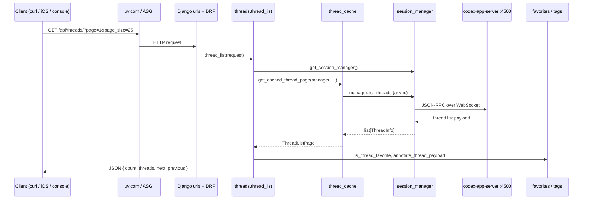

# Request Trace: `GET /api/threads/`

**Purpose:** Walk one HTTP request end-to-end to learn the control-plane architecture.  
**Level:** 2 (after [01_Repo_vs_Workspace](./01_Repo_vs_Workspace.md))  
**Index:** [INDEX.md](./INDEX.md)

---

## What This Endpoint Does

Lists Codex coding threads (sessions) with pagination, optional favorite filter, and local metadata (favorites, tags). Thread **state** comes from Codex app-server; favorites/tags are local overlays.

**Used by:** Web console Threads tab, iOS app.

---

## Sequence Diagram



---

## File Chain (read in this order)

| Step | File | What happens |
|------|------|--------------|
| 1 | `config/urls.py` | `/api/` → `openbase_coder_cli_app.urls` |
| 2 | `openbase_coder_cli_app/urls.py` | `threads/` → `thread_list` |
| 3 | `openbase_coder_cli_app/threads.py` | `thread_list()` — pagination, filters |
| 4 | `mcp/session_manager.py` | `get_session_manager()` singleton |
| 5 | `openbase_coder_cli_app/thread_cache.py` | Caches list pages to reduce Codex load |
| 6 | `mcp/models.py` | `ThreadInfo`, `TurnInfo` Pydantic models |
| 7 | `openbase_coder_cli_app/thread_metadata.py` | `annotate_thread_payload()` |
| 8 | `openbase_coder_cli_app/thread_favorites.py` | Local favorite state |

**Codex client implementation:** `super_agents.app_server_client.CodexAppServerClient` (in `../super-agents`).

---

## Key Code Anchors

**URL registration:**

```89:89:openbase_coder_cli/openbase_coder_cli_app/urls.py
    path("threads/", thread_list, name="thread-list"),
```

**View entry:**

```191:200:openbase_coder_cli/openbase_coder_cli_app/threads.py
@api_view(["GET", "POST"])
def thread_list(request):
    """List all active threads or create a new one."""
    logger.info(
        "thread_list start method=%s path=%s auth=%s",
        request.method,
        request.path,
        _auth_debug_value(request),
    )
    manager = get_session_manager()
```

**Session manager singleton:**

```1147:1152:openbase_coder_cli/mcp/session_manager.py
def get_session_manager() -> CodexAppServerSessionManager:
    """Get the singleton thread manager instance."""
    global _session_manager
    if _session_manager is None:
        _session_manager = CodexAppServerSessionManager()
    return _session_manager
```

---

## Hands-On Exercise

### 1. Start the server

```bash
cd openbase-coder
uv sync --extra dev
uv run openbase-coder server --reload --skip-collectstatic
```

### 2. Request (may need Codex running for real data)

```bash
curl -s 'http://127.0.0.1:7999/api/threads/?page=1&page_size=5' | jq
```

If `codex-app-server` is not running, expect an error response — that confirms the dependency chain.

### 3. Add a trace log

In `thread_list`, after `manager = get_session_manager()`:

```python
logger.info("TRACE: got session manager %s", type(manager).__name__)
```

Restart server, curl again, watch terminal output.

### 4. Run the test map

```bash
uv run pytest tests/test_threads_api.py -v
```

Tests document expected request/response shapes without reading all of `session_manager.py`.

---

## POST: Create Thread (same view)

`POST /api/threads/` with `{"directory": "/path/to/project"}`:

1. `thread_list` → `manager.create_thread(directory)`
2. `session_manager` → Codex `start_thread`
3. Returns `201` with `thread_id` + `directory`
4. Invalidates thread list cache

---

## What Is NOT in This Path

| Concern | Where it lives |
|---------|----------------|
| WebSocket live updates | `consumers.py` → `/ws/threads/<id>/` |
| Voice routing | `livekit_voice_route.py` |
| Django ORM | No thread models — `openbase_coder_cli_app/models.py` is empty |
| SQLite | Only incidental Django state, not thread bodies |

---

## Related Endpoints to Trace Next

| Endpoint | View | Priority |
|----------|------|----------|
| `GET /api/threads/<id>/` | `thread_detail` | High |
| `POST /api/threads/<id>/turns/` | `thread_start_turn` | High |
| `WS /ws/threads/<id>/` | `ThreadConsumer` | High — future `04_Request_Trace_WebSocket.md` |
| `GET /api/health/` | `health_check` | Easy smoke test |

---

## Related

- [00_Learning_Path](./00_Learning_Path.md) — Level 2 checklist
- [01_Repo_vs_Workspace](./01_Repo_vs_Workspace.md) — where Codex app-server fits
- [02_Dev_Cheatsheet](./02_Dev_Cheatsheet.md) — run commands
