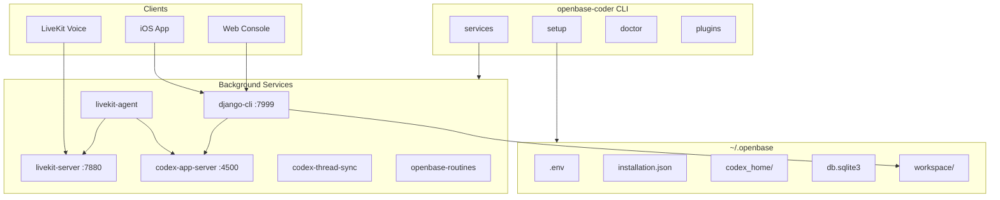

# ELIF: Openbase Coder Codebase

**Date:** 2026-06-18  
**Scope:** Full-repository orientation  
**Audience:** New contributors, agents, and maintainers ramping up on `openbase-coder`  
**Index:** [INDEX.md](./INDEX.md)  
**Read first:** [00_Learning_Path.md](./00_Learning_Path.md), [01_Repo_vs_Workspace.md](./01_Repo_vs_Workspace.md)

---

## Summary

**openbase-coder** is a local voice-coding runtime: a Python CLI that installs, configures, and runs the services needed to work with AI coding agents from your Mac/Linux machine, browser, iOS app, and Openbase Cloud clients.

At a high level, it is three things in one package:

1. **CLI** (`openbase-coder`) — setup, service management, auth, plugins
2. **Local API server** — Django + DRF + Channels (HTTP, WebSockets, MCP)
3. **Voice agent runtime** — LiveKit + Codex app-server + Super Agents

---

## Architecture



---

## Repository Layout

| Path | Role |
|------|------|
| `openbase_coder_cli/cli/` | Click CLI commands |
| `openbase_coder_cli/config/` | Django settings, URLs, ASGI, JWT auth |
| `openbase_coder_cli/openbase_coder_cli_app/` | REST API views, WebSocket consumers |
| `openbase_coder_cli/livekit_agent/` | Voice agent worker (~3k lines) |
| `openbase_coder_cli/mcp/` | MCP tools + Codex session manager |
| `openbase_coder_cli/services/` | launchd/systemd service definitions |
| `openbase_coder_cli/plugins/` | Plugin install, registry, console integration |
| `tests/` | pytest suite (~40 test files) |
| `docs/` | Command and configuration docs |

**Entry point:** `openbase-coder` → `openbase_coder_cli.cli:main` (Click group in `cli/__init__.py`).

---

## CLI Commands

Registered in `openbase_coder_cli/cli/__init__.py`:

| Command | Purpose |
|---------|---------|
| `setup` | Clone workspace, generate `.env`, build console, install services |
| `server` | Run Django/ASGI API on port 7999 |
| `services` | Install/start/stop launchd (macOS) or systemd (Linux) jobs |
| `doctor` | Health checks for install, secrets, services |
| `login` / `logout` | Openbase Cloud auth (JWT) |
| `backend` | Switch coding backend: `codex`, `claude-agent-sdk`, `claude-tui` |
| `plugins` / `bootstrap` | Extend runtime with plugins |
| `codex-sync` | Sync threads between devices / Codex homes |
| `routines` | Scheduled agent routines |
| `computer-use` | Linux-only DevSpace desktop automation |
| `user` | Voice user say/play helpers |
| `boilersync` | Template sync utility |
| `claude-chrome` | Claude Chrome integration |
| `restart` | Restart managed services |
| `super-agent-name` | Super agent naming helper |
| `exit-to-dispatch` | Exit voice route back to dispatcher |

Every CLI invocation refreshes Openbase-managed `AGENTS.md` via `refresh_openbase_agents_md_from_installation()`.

---

## Managed Services

Defined in `services/definitions.py` and installed via `setup`:

| Service | Port | Role |
|---------|------|------|
| `django-cli` | 7999 | API + web console + WebSockets + MCP |
| `livekit-server` | 7880 | Real-time voice rooms |
| `livekit-agent` | — | Voice worker connecting to Codex |
| `codex-app-server` | 4500 | OpenAI Codex app-server WebSocket |
| `codex-thread-sync` | — | Periodic thread sync |
| `codex-thread-device-sync` | — | Cross-device thread exchange (optional) |
| `openbase-routines` | — | Due routine runner |

Default install set excludes `codex-thread-device-sync`. Everything persists under `~/.openbase` (see `docs/files-and-paths.md`).

---

## API Server Architecture

**Stack:** Django 5.2, DRF, Channels, WhiteNoise, CORS, `django-mcp-server`, Uvicorn/Gunicorn.

**URL routing** (`config/urls.py`):

- `/admin/` — Django admin
- `/api/` — REST API (`openbase_coder_cli_app/urls.py`)
- `/mcp` — MCP tools via `django-mcp-server`
- `/*` — Built React console SPA (catch-all)

**Major API domains:**

- **Threads** — list/detail, turns, favorites, tags, interrupt
- **Projects** — recent projects, git diff, status
- **Reports** — project reports CRUD
- **LiveKit** — room tokens, voice routing, companion sessions
- **Settings** — coding backend, TTS/STT, env, dispatcher voice
- **Services** — launchctl/systemd control from the console
- **Plugins** — registry, bootstrap runners
- **Auth** — JWT session/refresh against Openbase Cloud

**WebSockets:**

- `/ws/threads/` — global turn updates
- `/ws/threads/<id>/` — per-thread realtime state

Backed by `session_manager.py` (Codex app-server client) and `consumers.py`. Auth via `TokenAuthMiddleware`.

---

## Core Data Flow: Threads

Thread state is **not** stored in Django ORM models (CronJob models were removed in migration `0002`; `openbase_coder_cli_app/models.py` is a stub). Instead:

1. **Codex app-server** (`ws://127.0.0.1:4500`) is the source of truth for threads/turns
2. **`mcp/session_manager.py`** wraps `super_agents.app_server_client.CodexAppServerClient`
3. **Pydantic models** in `mcp/models.py` (`ThreadInfo`, `TurnInfo`, `ThreadStatus`)
4. **Local metadata** (favorites, tags) via `thread_favorites.py`, `item_tags.py`, `thread_metadata.py`
5. **WebSocket consumers** push live updates to iOS/console

---

## Voice Agent

`livekit_agent/livekit.py` is the voice coding worker:

- Joins LiveKit rooms as an agent worker
- **STT:** AssemblyAI, Deepgram, local MLX Whisper, or Openbase Cloud
- **TTS:** Cartesia, Kokoro (local), or Openbase Cloud
- Talks to **Codex app-server** via `codex_app_client.py`
- Uses **Super Agents** for multi-agent dispatch (`super_agents_client.py`)
- Reads instructions from `~/.openbase/instructions/` and `dispatcher-config.json`

Voice routing (dispatcher vs direct vs super-agent) is managed through `livekit_voice_route.py` and related APIs.

---

## Coding Backends

Supported backends (`backend_config.py`):

- `codex` (default)
- `claude-agent-sdk`
- `claude-tui`

Setup seeds separate config trees:

- `~/.openbase/codex_home/` — Codex voice sessions (AGENTS.md, config.toml, skills)
- `~/.openbase/claude_config/` — Claude Code sessions (CLAUDE.md, `.claude.json`)

---

## Plugins

Extensibility via `plugins/`:

- Registry at `~/.openbase/plugins/plugins.json`
- Can add: Django URL modules, console pages, bootstrappers, project views, skills
- Plugin changes trigger a delayed API restart

---

## MCP Integration

`mcp/mcp.py` exposes tools such as:

- Import/export threads between normal (`~/.codex`) and voice (`~/.openbase/codex_home`) Codex homes
- Dispatcher config (reasoning effort, voice settings)

Served at `/mcp` via `django-mcp-server`.

---

## Setup Flow

`openbase-coder setup` (`cli/setup.py`, ~1200 lines) orchestrates:

1. Clone `openbase-coder-workspace` into `~/.openbase/workspace`
2. `multi-workspace` sync of the install set
3. Generate `~/.openbase/.env` (secrets, API keys, LiveKit keys)
4. Write `installation.json`
5. Seed instruction files, dispatcher config, Codex/Claude homes
6. Symlink workspace skills into agent homes
7. Build the React console (`workspace/console`)
8. Install launchd/systemd services
9. Optional Tailscale serve, STT/TTS provider setup

---

## Tech Stack

| Layer | Technologies |
|-------|-------------|
| Language | Python 3.13+ |
| CLI | Click |
| API | Django 5.2, DRF, Channels |
| Voice | LiveKit Agents, AssemblyAI, Cartesia, Deepgram, MLX Whisper |
| Agents | Codex app-server, Super Agents, LangChain/LangGraph |
| Auth | PyJWT + Openbase Cloud JWKS |
| Packaging | hatchling, uv, AGPL-3.0 |
| Tests | pytest, pytest-asyncio |

---

## Development

```bash
uv sync --extra dev
uv run openbase-coder --version
uv run pytest
```

The workspace repo (`openbase-coder-workspace`) is a separate clone; this repo is the **runtime/CLI package** published to PyPI as `openbase-coder`.

`super-agents` is an editable local path dependency (`../super-agents`) in `pyproject.toml`.

---

## Mental Model

Think of this repo as a **local orchestration layer** for AI coding:

- **Codex app-server** runs the actual coding sessions
- **Django API** is the control plane for clients (iOS, web, automations)
- **LiveKit agent** is the voice interface to those sessions
- **CLI + services** keep everything installed, configured, and running in the background

---

## Companion Library

This snapshot is part of `docs/codebase-companion/`. For the progressive ramp-up path and newer guides, see:

| Doc | Purpose |
|-----|---------|
| [00_Learning_Path](./00_Learning_Path.md) | Ordered curriculum with exercises |
| [01_Repo_vs_Workspace](./01_Repo_vs_Workspace.md) | This repo vs workspace vs super-agents |
| [02_Dev_Cheatsheet](./02_Dev_Cheatsheet.md) | Commands, ports, troubleshooting |
| [03_Request_Trace_Threads](./03_Request_Trace_Threads.md) | End-to-end API trace |
| [2026-06-18 ELIF_Setup](./2026-06-18%20ELIF_Setup.md) | Setup phase map |
| [INDEX](./INDEX.md) | Full document index |
| [CHANGELOG](./CHANGELOG.md) | Companion doc history |
