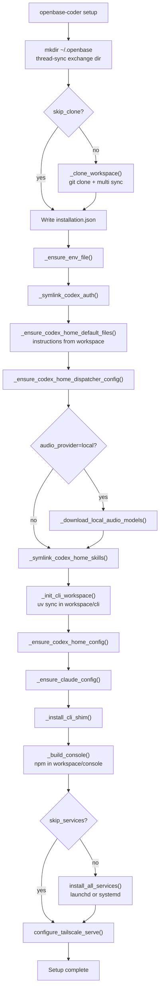

# ELIF: Setup Pipeline (`setup.py`)

**Date:** 2026-06-18  
**Scope:** Phase map of `openbase_coder_cli/cli/setup.py` (~1220 lines)  
**When to read:** Level 3 — after [03_Request_Trace_Threads](./03_Request_Trace_Threads.md)  
**Index:** [INDEX.md](./INDEX.md)

---

## Why Not Read It Linearly?

`setup.py` is an orchestration script: clone workspace, write config, build UI, install OS services. You need the [repo vs workspace model](./01_Repo_vs_Workspace.md) first. Use this doc as a **map**, then jump to specific `_helper()` functions as needed.

---

## Phase Diagram



---

## Phase Reference

| # | Phase | Function(s) | Output / side effect |
|---|-------|-------------|----------------------|
| 0 | Preflight | `setup()` top | macOS/Linux only; creates `~/.openbase` |
| 1 | Thread sync dir | `_ensure_thread_sync_exchange_dir()` | `~/.openbase/thread-sync/` for Syncthing |
| 2 | Workspace clone | `_clone_workspace()` | `~/.openbase/workspace/` + sub-repos via `multi sync` |
| 3 | Installation record | `InstallationConfig.save()` | `installation.json` |
| 4 | Environment | `_ensure_env_file()` | `~/.openbase/.env` (secrets, keys, backend) |
| 5 | Codex auth link | `_symlink_codex_auth()` | `codex_home/auth.json` → `~/.codex/auth.json` |
| 6 | Instructions | `_ensure_codex_home_default_files()` | Seeds from `{workspace}/instructions/` |
| 7 | Dispatcher config | `_ensure_codex_home_dispatcher_config()` | `dispatcher-config.json` |
| 8 | Local audio models | `_download_local_audio_models()` | Only if `--audio-provider local` |
| 9 | Skills | `_symlink_codex_home_skills()` | Symlinks workspace skills → agent homes |
| 10 | CLI workspace | `_init_cli_workspace()` | `uv sync` in workspace; LiveKit model downloads |
| 11 | Codex config | `_ensure_codex_home_config()` | `codex_home/config.toml`, Super Agents MCP |
| 12 | Claude config | `_ensure_claude_config()` | `claude_config/CLAUDE.md`, `.claude.json` |
| 13 | CLI shim | `_install_cli_shim()` | User-facing `openbase-coder` on PATH |
| 14 | Console build | `_build_console()` | `{workspace}/console/dist` |
| 15 | Services | `install_all_services()` | launchd plists or systemd units |
| 16 | Tailscale | `configure_tailscale_serve()` | iOS remote access routes |

---

## CLI Options That Matter

| Flag | Effect |
|------|--------|
| `--workspace-dir` | Override clone location (default `~/.openbase/workspace`) |
| `--env-file` | Override `.env` path |
| `--skip-clone` | Skip git clone (workspace must already exist) |
| `--skip-services` | Skip launchd/systemd install |
| `--link-codex-config` | Symlink service Codex config to `~/.codex/config.toml` |
| `--backend` | Set `OPENBASE_CODING_BACKEND` in new `.env` |
| `--audio-provider` | `openbase-cloud`, `cartesia`, or `local` |

---

## Workspace Coupling in Setup

| Constant | Value | Meaning |
|----------|-------|---------|
| `WORKSPACE_REPO` | `openbase-community/openbase-coder-workspace` | What gets cloned |
| `WORKSPACE_INSTALL_SET` | `"default"` | Which `multi.json` repos to sync |
| `CODEX_HOME_DEFAULT_SOURCE_DIR` | `"instructions"` | Instruction templates |
| `CODEX_HOME_SKILLS_SOURCE_DIR` | `"skills"` | Skill symlink sources |

**`_multi_sync()`** calls `sync_workspace(ws_path, install_set="default")` from `multi.api`.

**`_install_set_repo_names()`** reads `workspace/multi.json` and filters repos tagged with the `default` install set.

See [01_Repo_vs_Workspace](./01_Repo_vs_Workspace.md) for the full three-repo picture.

---

## What Gets Installed as Services

After phase 15, these run in the background (default install set from `services/definitions.py`):

| Service | Port |
|---------|------|
| `livekit-server` | 7880 |
| `codex-app-server` | 4500 |
| `livekit-agent` | — |
| `codex-thread-sync` | — |
| `openbase-routines` | — |
| `django-cli` | 7999 |

---

## How to Explore Safely

```bash
# Dry run understanding — read phases without executing
grep -n '^def _' openbase_coder_cli/cli/setup.py | head -40

# Partial setup for dev (common patterns)
openbase-coder setup --skip-services    # install files without background jobs
openbase-coder setup --skip-clone       # reuse existing workspace
```

**Do not** read all 1220 lines in one sitting. Pick one phase from the table above, read that function, check what files it creates under `~/.openbase`, move on.

---

## Related Helpers Outside `setup.py`

| Concern | Module |
|---------|--------|
| Service install | `services/launchd.py`, `services/systemd.py` |
| Installation config | `services/installation.py` |
| Tailscale routes | `services/tailscale_serve.py` |
| Paths | `paths.py` |
| STT/TTS providers | `stt_providers.py`, `tts_providers.py` |

---

## Exercise (Level 3)

1. Run `openbase-coder setup --skip-services` (or inspect an existing `~/.openbase`)
2. Open `installation.json` and `.env` — map keys to phases 3–4
3. List `~/Library/LaunchAgents/com.openbase.coder.*` (macOS) or systemd units (Linux)
4. Match each plist/unit to a row in `services/definitions.py`

---

## Related

- [01_Repo_vs_Workspace](./01_Repo_vs_Workspace.md)
- [02_Dev_Cheatsheet](./02_Dev_Cheatsheet.md)
- [docs/commands/setup.md](../commands/setup.md) — user-facing setup docs
- [docs/files-and-paths.md](../files-and-paths.md) — artifact reference
